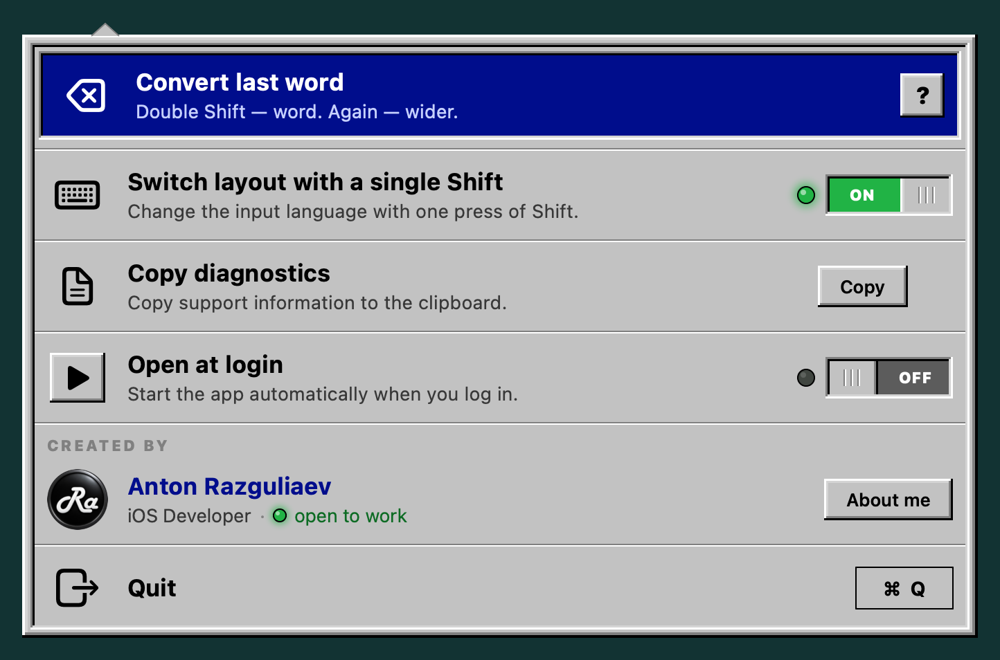

**English** | [Русский](README.ru.md)

# LayoutSwitcher

A free keyboard-layout fixer for macOS. Open source, Swift, no dependencies.

It retypes text you entered in the wrong layout. Typed `ghjdthrf` instead of `проверка`? Double-tap Shift and it's fixed.

Double-tap Shift again and the scope grows: word → sentence → since the last layout change → whole line. A 2-second pause resets the chain. If the scope has already been converted, another double Shift puts it back.

A single short tap on either Shift just switches the input layout — instantly, without Cmd+Space. Shift used with a letter, or held down, doesn't switch anything. You can turn this off in the menu.

Lives in the menu bar, no Dock icon.



The interface is available in 13 languages: English, Russian, Spanish, French, Portuguese, German, Turkish, Arabic, Chinese (Simplified), Italian, Japanese, Ukrainian and Hindi. It follows your system language and falls back to English.

> Converting isn't limited to Russian: it works with a Latin layout paired with any non-Latin one, because the character map is built from the layouts themselves.

---

## 📥 [Download LayoutSwitcher.dmg](https://github.com/AntonR8/LayoutSwitcher/releases/latest/download/LayoutSwitcher.dmg)

Requires macOS 13 or later. Runs natively on Apple Silicon and Intel. Signed and notarized by Apple.

The same release as an archive: [LayoutSwitcher.zip](https://github.com/AntonR8/LayoutSwitcher/releases/latest/download/LayoutSwitcher.zip). SHA-256 checksums are listed in every [release](https://github.com/AntonR8/LayoutSwitcher/releases).

---

## Install

**1.** Open `LayoutSwitcher.dmg` and double-click `LayoutSwitcher` in its window. macOS will ask whether you want to open an app downloaded from the internet — click Open.

**2.** The app copies itself to Applications, closes the installer window, ejects the disk image and relaunches from Applications.

> Dragging `LayoutSwitcher` onto the Applications shortcut and launching it from there works too. If you launch it from Downloads or another folder, the setup window offers to move it for you.

**3.** The setup window opens and walks you through the rest; each step lights up when it's done:

- **Keyboard access.** Click “Grant access”, choose “Open System Settings” in the macOS window and turn on LayoutSwitcher. No restart needed — the app picks up the permission by itself.
- **Try it.** Type the suggested word in the wrong layout and press Shift twice.
- **Open at login**, so the app keeps working after a restart.

You can reopen the window later with the “?” button in the menu. The icon itself is a Shift key in the menu bar at the top right.

If you'd rather not grant this kind of access to a binary you haven't checked — [build it yourself](#build-from-source), it's two commands.

## Updating

The app never updates itself or checks for new versions: it has no networking code, on purpose. New versions appear on the [Releases](https://github.com/AntonR8/LayoutSwitcher/releases) page — use Watch → Custom → Releases to get notified.

To update: quit LayoutSwitcher (⌘Q in its menu), download the new version and replace the app in Applications. Your settings are kept.

> **Updating from 1.13 or earlier?** You'll need to grant keyboard access again: since 1.14 the app has a different signature, and macOS ties the permission to the signature. In **Accessibility**, remove the old LayoutSwitcher entry with “−” and add the app again.

## Uninstall

1. Quit LayoutSwitcher (⌘Q in its menu).
2. If “Open at login” was on, turn it off in the menu first, or remove LayoutSwitcher in **System Settings → General → Login Items**.
3. Delete `LayoutSwitcher.app` from Applications.
4. In **Accessibility**, remove the LayoutSwitcher entry with “−”.
5. Settings (a single on/off value for single Shift): `defaults delete local.anton.layoutswitcher`.

## Troubleshooting

1. Open the menu. A red “No keyboard access” row means the permission isn't granted: click it to open the setup window. Its “Grant access” button first resets the old LayoutSwitcher entry in Accessibility, so the macOS prompt appears even if access was once given to another build or denied.
2. If there's no red row but converting doesn't work, click **Copy** in the “Copy diagnostics” row and attach the report to a [bug report](https://github.com/AntonR8/LayoutSwitcher/issues/new?template=bug_report.md). It shows where things stop: access, keyboard tap, layouts, reading the text field. What you typed is never included.
3. You can also get the report from Terminal: `/Applications/LayoutSwitcher.app/Contents/MacOS/LayoutSwitcher --diagnostics`. But there the access lines reflect Terminal's permissions, not the app's, so the report from the menu is more reliable.

---

## Why it needs keyboard access

The app needs two things, and a single Accessibility switch grants both.

First, to notice Shift presses: it installs an event tap (`CGEventTap`, listen-only).

Second, to read and rewrite the text field. Instead of blindly sending backspaces, it reads the field's actual contents through Accessibility. Otherwise it would break wherever the field doesn't match what was typed: Spotlight with a previous query, an address bar with autocomplete, pasted text.

**This is the same level of access a keylogger has.** So, honestly:

- The app **sends nothing anywhere** — there is no networking code at all. The “?” and “About me” buttons just open a web page in your browser.
- **What you type is never stored.** The fallback buffer lives in memory only and is cleared on Enter, Tab, arrows, mouse clicks and Cmd/Ctrl/Option shortcuts. The only thing on disk is one setting — single Shift on/off — in `~/Library/Preferences/local.anton.layoutswitcher.plist`.
- The text field is read only at the moment of a double Shift, never continuously.

You can verify all of this in the source — about 1,700 lines in eight files, see [How it works](#how-it-works).

If you don't trust the prebuilt binary, build it yourself (see below). That's the right reaction to an app asking for this kind of access.

---

## Build from source

Requires Xcode or the Command Line Tools (`xcode-select --install`).

```
./build.sh          # builds ~/Library/Caches/LayoutSwitcher/build/LayoutSwitcher.app
./test.sh           # tests: scope boundaries, Shift taps, translation completeness
```

The build goes outside the project folder: if the project lives in iCloud Drive, iCloud adds extended attributes to the bundle and `codesign` refuses to sign it. Override with `BUILD=<folder> ./build.sh`.

`build.sh` produces a universal binary (arm64 + x86_64) with a minimum of macOS 13.0, matching `Info.plist`.

By default the build is signed ad-hoc. It works, but you'll have to grant Accessibility again after every rebuild: the permission is tied to the signature, and an ad-hoc signature changes with the binary.

Sign with your own certificate to keep the permission across rebuilds:

```
SIGN_ID=<certificate fingerprint> ./build.sh
```

Notarization is for builds you give to other people. It needs a **Developer ID Application** certificate and an App Store Connect API key (read from `~/.appstoreconnect/config.json`, see the comment in `build.sh`):

```
NOTARIZE=1 SIGN_ID=<Developer ID Application fingerprint> ./build.sh
```

The app and the disk image are sent to Apple, the tickets are stapled, and `LayoutSwitcher.dmg` and `LayoutSwitcher.zip` land in `dist/`.

A whole release in one command — bumps the version, runs the tests, builds and notarizes, commits, creates the GitHub release with SHA-256 checksums, and checks that the download links serve exactly these files:

```
./release.sh 1.16 notes.md
```

> ⚠️ **Never sign with a revoked certificate.** It's worse than not signing: macOS treats the build as malware, shows “Malware Blocked and Moved to Trash” and moves the app to the Trash, and the user can't override it — unlike ad-hoc, where confirming the launch is enough.
>
> `security find-identity` won't warn you: it shows a cached status and happily reports a certificate Apple has revoked as valid. That's why `build.sh` asks Gatekeeper after signing and falls back to ad-hoc if the certificate is revoked.

### Checking the menu without running the app

```
./Tests/render_menu.sh                 # the menu in every language → build/menu/<lang>.png
./Tests/render_menu.sh out --a11y      # plus what VoiceOver will read
./Tests/render_setup.sh                # the setup window in every language and step → build/setup/<lang>-<step>.png
```

Use it to check the layout after changing translations and to make the README screenshots (`Assets/screenshots`).

## Icons

There are three.

**Menu bar icon** — a Shift key. Sources: `Assets/StatusIcon.svg` and `Assets/StatusIconOn.svg` (green arrow: single Shift switches layouts). It's a colour image, not a template: the grey key reads well on both light and dark menu bars. The PNGs (`StatusIcon*.png`, 18 pt at 1x/2x/3x) are pre-rendered from the SVGs because `NSImage` can't read SVG on macOS 13. Edit the SVG — re-render the PNGs.

**App icon** comes in two forms, and both are needed:

| File | Becomes | Who sees it |
|---|---|---|
| `Assets/AppIcon.icon` | `Assets.car` via `actool` | macOS 26 — the “live” icon with all effects |
| `Assets/icon.png` | `AppIcon.icns` via `sips` + `iconutil` | macOS 13–15, which don't support `.icon` |

`Assets/AppIcon.icon` is the source, an [Icon Composer](https://developer.apple.com/documentation/xcode/creating-your-app-icon-using-icon-composer) document. Edit only that.

`Assets/icon.png` is a flat 1024×1024 rendering of the same icon. It's needed because the `.icns` that `actool` writes next to `Assets.car` is capped at 256×256 and looks blurry in Finder at large sizes. A full-size `.icns` is built from the PNG and replaces it.

If you edit the `.icon`, regenerate the PNG too, or older macOS versions will keep the old icon. Let the system render it: build the app, register it with Launch Services (`lsregister -f`) and take the 1024×1024 representation from `NSWorkspace.shared.icon(forFile:)`.

The build doesn't fail without an app icon: no `.icon` means no `Assets.car`, no PNG means no `.icns`; both are just warnings.

**The author's logo** in the menu is `Resources/Developer.png`.

**The DMG window background** is `Assets/dmg/background.tiff` (1x and 2x in one file), drawn by `Tools/make_dmg_background.sh`. `build.sh` places the icons through Finder; their positions must match the slots on the background.

## How it works

| File | What it does |
|---|---|
| `Sources/Mapping.swift` | the character map, built by enumerating keys with `UCKeyTranslate` |
| `Sources/Extent.swift` | scope boundaries: word, sentence, script change, line |
| `Sources/Chain.swift` | what a repeated double Shift does: expand, undo or start over |
| `Sources/ShiftTap.swift` | recognising single and double Shift taps |
| `Sources/RetroMenu.swift` | the menu bar panel (SwiftUI): toggles, diagnostics, author, quit |
| `Sources/Localization.swift`, `Resources/*.lproj` | UI translations in 13 languages; `Tests/check_localization.py` checks they're complete |
| `Sources/AXText.swift` | reading and writing the focused field through Accessibility |
| `Sources/main.swift` | keyboard tap, layout switching, gluing it all together |

The character map comes from the layouts' own data rather than being hard-coded, so punctuation, digits and non-standard layouts just work.

---

## Known limitations

- No automatic mode: the app doesn't guess mistakes, it converts only on a double Shift.
- The first tap of a double Shift already switches the layout; the second switches it back and converts the text. So during a double Shift the layout flips back and forth for a split second — you can see it in the system input indicator.
- Works with two layouts — one Latin and one non-Latin. With three or more enabled, it pairs the first suitable ones.
- Doesn't touch selected text, only what's before the caret.
- In apps that don't expose the text field through Accessibility (some terminals, games) a fallback retypes with backspaces. It can misbehave in fields with autocomplete.
- Translations other than English, Russian and Ukrainian weren't reviewed by native speakers. Spotted a mistake? [Let me know](https://github.com/AntonR8/LayoutSwitcher/issues).

---

## Author


**Anton Razguliaev** — iOS developer. LayoutSwitcher is free; if you find it useful, have a look at [antonr8.github.io](https://antonr8.github.io) for my other apps and contacts.

<br clear="left">

## License

MIT — do what you like, no warranty. See [LICENSE](LICENSE).
