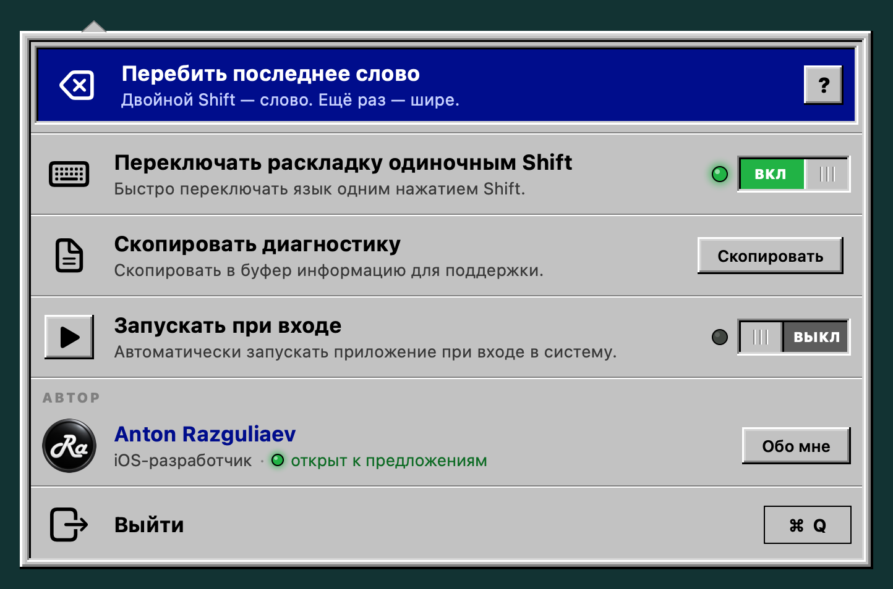

[English](README.md) | **Русский**

# LayoutSwitcher

Бесплатный переключатель раскладки для macOS. Открытый код, Swift, без зависимостей.

Перебивает текст, набранный не в той раскладке. Набрал `ghjdthrf` — двойной Shift, получилось `проверка`.

Нажми Shift ещё раз, и охват расширится: слово → предложение → с последней смены раскладки → вся строка. Пауза в 2 секунды сбрасывает цепочку. Если охват уже перебит, повторный двойной Shift вернёт как было.

Короткое нажатие Shift — левого или правого — само по себе переключает раскладку: русский ↔ английский, мгновенно и без Cmd+Space. Shift с буквой или долгое удержание раскладку не трогают. Выключается в меню значка.

Живёт в строке меню, иконки в Dock нет.



Интерфейс на 13 языках: английский, русский, испанский, французский, португальский, немецкий, турецкий, арабский, китайский (упрощённый), итальянский, японский, украинский и хинди. Язык выбирается по настройкам системы; если его нет в списке — английский.

---

## 📥 [Скачать LayoutSwitcher.dmg](https://github.com/AntonR8/LayoutSwitcher/releases/latest/download/LayoutSwitcher.dmg)

Нужна macOS 13 или новее. Работает и на Apple Silicon, и на Intel. Сборка подписана и нотаризована Apple.

Тот же релиз в виде архива: [LayoutSwitcher.zip](https://github.com/AntonR8/LayoutSwitcher/releases/latest/download/LayoutSwitcher.zip). Контрольные суммы SHA-256 — в описании каждого [релиза](https://github.com/AntonR8/LayoutSwitcher/releases).

---

## Установка

**1.** Открой `LayoutSwitcher.dmg` и дважды щёлкни `LayoutSwitcher` в его окне. macOS спросит, точно ли открыть программу из интернета, — жми «Открыть».

**2.** Программа сама скопирует себя в «Программы», закроет окно установщика, извлечёт образ и запустится уже оттуда.

> Можно и по-старому: перетащить `LayoutSwitcher` на ярлык «Программы» и запустить из «Программ». Если запустить её из «Загрузок» или другой папки, окно настройки предложит перенести её само.

**3.** Откроется окно настройки — дальше оно ведёт по шагам, и у каждого загорается лампочка, когда он выполнен:

- **Доступ к клавиатуре.** Нажми «Выдать доступ», в окне macOS — «Открыть Системные настройки» и включи LayoutSwitcher. Перезапускать не нужно: программа подхватит разрешение сама.
- **Проверка.** Набери в поле подсказанное слово не в той раскладке и дважды нажми Shift.
- **Запускать при входе** — чтобы программа работала и после перезагрузки.

Потом окно можно открыть кнопкой «?» в меню значка. Сам значок — клавиша Shift в строке меню справа вверху.

Если запускать программу с таким доступом не хочется без проверки — [собери её сам из исходников](#сборка-из-исходников), это пара команд.

## Обновление

Сама программа не обновляется и о новых версиях не сообщает: сетевого кода в ней нет, и это сделано намеренно. Новые версии выходят на странице [Releases](https://github.com/AntonR8/LayoutSwitcher/releases) — подпишись там на уведомления (Watch → Custom → Releases), если хочешь узнавать о них.

Чтобы обновиться: выйди из LayoutSwitcher (⌘Q в меню значка), скачай новую версию и замени приложение в «Программах». Настройки сохранятся.

> **Если обновляешься с версии 1.13 или старше**, доступ к клавиатуре придётся выдать заново: с версии 1.14 у приложения другая подпись, а система привязывает разрешение к подписи. В **Универсальном доступе** удали старую запись LayoutSwitcher кнопкой «−» и добавь приложение снова.

## Удаление

1. Выйди из LayoutSwitcher (⌘Q в меню значка).
2. Если был включён автозапуск — выключи его заранее в меню или удали LayoutSwitcher в **Системных настройках → Основные → Объекты входа**.
3. Удали `LayoutSwitcher.app` из «Программ».
4. В **Универсальном доступе** удали запись LayoutSwitcher кнопкой «−».
5. Настройки (одна строка — вкл/выкл одиночного Shift): `defaults delete local.anton.layoutswitcher`.

## Если не работает

1. Открой меню значка. Красная строка «Нет доступа к клавиатуре» — значит, не выдан доступ: нажми на неё, откроется окно настройки. Кнопка «Выдать доступ» там сначала сбрасывает старую запись LayoutSwitcher в «Универсальном доступе» — поэтому запрос macOS появляется, даже если раньше доступ давали другой сборке или отказали.
2. Если строки нет, а перебивка не срабатывает — в меню нажми **«Скопировать»** в строке «Скопировать диагностику» и приложи отчёт к [сообщению об ошибке](https://github.com/AntonR8/LayoutSwitcher/issues/new?template=bug_report.md). В отчёте видно, на каком шаге всё останавливается: доступ, перехват клавиатуры, раскладки, чтение поля. Набранный текст в отчёт не попадает.
3. Отчёт можно снять и из Терминала: `/Applications/LayoutSwitcher.app/Contents/MacOS/LayoutSwitcher --diagnostics`. Но строки о доступе там относятся к правам Терминала, а не программы, поэтому надёжнее отчёт из меню.

---

## Почему требуется доступ к клавиатуре

Программе нужно два разрешения, и оба даёт один переключатель «Универсальный доступ».

Первое — знать, что нажат Shift: она ставит перехватчик событий (`CGEventTap` в режиме «только слушать»).

Второе — прочитать и переписать поле ввода. Программа не эмулирует забои вслепую, а берёт реальное содержимое поля через Accessibility. Иначе ломается везде, где текст в поле не совпадает с набранным: Spotlight с прошлым запросом, адресная строка с автодополнением, вставка из буфера обмена.

**Это тот же уровень доступа, что у кейлоггера.** Так что честно:

- Программа **никуда ничего не отправляет** — сетевого кода в ней нет вообще. Кнопки «?» и «About me» в меню только открывают страницу в браузере.
- **Набранный текст никуда не записывается.** Запасной буфер живёт только в памяти и сбрасывается на Enter, Tab, стрелках, клике мышью и сочетаниях с Cmd/Ctrl/Option. На диске хранится одна настройка — вкл/выкл одиночного Shift — в `~/Library/Preferences/local.anton.layoutswitcher.plist`.
- Поле читается только в момент двойного Shift, а не постоянно.

Проверить всё это можно по исходникам — около 1700 строк в восьми файлах, что где лежит — в разделе [«Как устроено»](#как-устроено).

Если не доверяешь готовому бинарнику — собери сам, см. ниже. Это правильная реакция на программу, которая просит такой доступ.

---

## Сборка из исходников

Нужен Xcode или Command Line Tools (`xcode-select --install`).

```
./build.sh          # собрать в ~/Library/Caches/LayoutSwitcher/build/LayoutSwitcher.app
./test.sh           # тесты логики границ, нажатий Shift и полноты переводов
```

Сборка идёт вне папки проекта: если та лежит в iCloud Drive, он вешает на бандл свои атрибуты, и `codesign` отказывается подписывать. Другую папку можно задать так: `BUILD=<папка> ./build.sh`.

`build.sh` собирает universal binary (arm64 + x86_64) с минимальной версией macOS 13.0 — той же, что указана в `Info.plist`.

По умолчанию подпись ad-hoc. Работать будет, но доступ к Универсальному доступу придётся выдавать заново после каждой пересборки: он привязан к подписи, а у ad-hoc она меняется вместе с бинарём.

Свой сертификат задаётся через переменную окружения — с ним подпись стабильна и выданный доступ переживает пересборку:

```
SIGN_ID=<отпечаток сертификата> ./build.sh
```

Нотаризация — для сборки, которую выкладываешь другим. Нужны сертификат **Developer ID Application** и ключ App Store Connect API (берётся из `~/.appstoreconnect/config.json`, подробности в комментарии в `build.sh`):

```
NOTARIZE=1 SIGN_ID=<отпечаток Developer ID Application> ./build.sh
```

Приложение и образ уходят в Apple на проверку, результат пришивается к ним (`stapler`), готовые `LayoutSwitcher.dmg` и `LayoutSwitcher.zip` ложатся в `dist/`.

Выпуск версии целиком — одной командой: поднимает версию, прогоняет тесты, собирает и нотаризует, коммитит, создаёт релиз на GitHub с SHA-256 и проверяет, что по ссылкам «Скачать» отдаются ровно эти файлы:

```
./release.sh 1.16 notes.md
```

> ⚠️ **Не подписывай отозванным сертификатом.** Это хуже, чем не подписывать вовсе: macOS считает такую сборку вредоносом, показывает «Malware Blocked and Moved to Trash» и переносит приложение в Корзину. Пользователь не может это обойти никак — в отличие от ad-hoc, где достаточно подтвердить запуск.
>
> `security find-identity` тут не помощник: он показывает закешированный статус и спокойно называет валидным сертификат, отозванный Apple. Поэтому `build.sh` проверяет подпись через Gatekeeper уже после подписания и сам откатывается на ad-hoc, если сертификат отозван.

### Проверка меню без запуска

```
./Tests/render_menu.sh                 # меню на всех языках → build/menu/<язык>.png
./Tests/render_menu.sh out --a11y      # плюс то, что прочитает VoiceOver
./Tests/render_setup.sh                # окно настройки на всех языках и шагах → build/setup/<язык>-<шаг>.png
```

Так проверяется вёрстка после правки переводов и снимаются скриншоты для README (`Assets/screenshots`).

## Значки

Их три.

**В строке меню** — клавиша Shift. Исходники — `Assets/StatusIcon.svg` и `Assets/StatusIconOn.svg` (зелёная стрелка: одиночный Shift меняет раскладку). Значок цветной, не template: серая клавиша читается и на светлой, и на тёмной строке меню. PNG (`StatusIcon*.png`, 18 pt в 1x/2x/3x) отрисованы из SVG заранее, потому что на macOS 13 `NSImage` SVG не читает. Правишь SVG — перерисуй и PNG.

**Значок приложения** лежит в двух видах, и оба нужны:

| Файл | Во что превращается | Кто его видит |
|---|---|---|
| `Assets/AppIcon.icon` | `Assets.car` через `actool` | macOS 26 — «живой» значок со всеми эффектами |
| `Assets/icon.png` | `AppIcon.icns` через `sips` + `iconutil` | macOS 13…15, где `.icon` не поддерживается |

`Assets/AppIcon.icon` — исходник, документ [Icon Composer](https://developer.apple.com/documentation/xcode/creating-your-app-icon-using-icon-composer). Правится только он.

`Assets/icon.png` — плоская отрисовка того же значка в 1024×1024. Нужна потому, что `.icns`, который `actool` кладёт рядом с `Assets.car`, обрезан по 256×256 и в Finder на крупных размерах мылит. Полноразмерный `.icns` собирается из PNG и перекрывает обрезанный.

Если правишь `.icon` — перегенерируй и PNG, иначе на старых macOS останется прежний значок. Отрисовать можно системой: собрать приложение, зарегистрировать его в Launch Services (`lsregister -f`) и забрать у `NSWorkspace.shared.icon(forFile:)` представление 1024×1024.

Сборка без значка приложения не падает: нет `.icon` — не будет `Assets.car`, нет PNG — не будет `.icns`, оба случая только предупреждение.

**Логотип автора** в меню — `Resources/Developer.png`.

**Фон окна DMG** — `Assets/dmg/background.tiff` (1x и 2x в одном файле), рисуется скриптом `Tools/make_dmg_background.sh`. Места значков в окне задаёт `build.sh` через Finder, они должны совпадать с гнёздами на фоне.

## Как устроено

| Файл | Что делает |
|---|---|
| `Sources/Mapping.swift` | таблица «символ → символ», строится перебором клавиш через `UCKeyTranslate` |
| `Sources/Extent.swift` | границы охвата: слово, предложение, смена алфавита, строка |
| `Sources/Chain.swift` | что делает повторный двойной Shift: расширить, вернуть или начать заново |
| `Sources/ShiftTap.swift` | распознавание одиночного и двойного нажатия Shift |
| `Sources/RetroMenu.swift` | панель значка в строке меню (SwiftUI): тумблеры, диагностика, автор, выход |
| `Sources/Localization.swift`, `Resources/*.lproj` | переводы интерфейса на 13 языков; `Tests/check_localization.py` проверяет, что все языки полные |
| `Sources/AXText.swift` | чтение и запись поля в фокусе через Accessibility |
| `Sources/main.swift` | перехват клавиатуры, смена раскладки, склейка всего вместе |

Таблица соответствий строится из данных самих раскладок, а не задана в коде. Поэтому пунктуация, цифры и нестандартные раскладки работают сами собой.

---

## Известные ограничения

- Нет автоматического режима: программа не угадывает ошибку сама, перебивает только по двойному Shift.
- Первое нажатие двойного Shift успевает переключить раскладку, второе возвращает её обратно и перебивает текст. Поэтому при двойном Shift раскладка на долю секунды меняется туда и обратно — это видно по системному индикатору раскладки.
- Работает с двумя раскладками — латинской и нелатинской. Если включено три и больше, в пару берётся первая подходящая.
- Не трогает выделенный текст, только то, что стоит перед кареткой.
- В программах, которые не отдают поле через Accessibility (некоторые терминалы, игры), работает запасной путь — стирание забоями. Там возможны ошибки в полях с автодополнением.
- Переводы интерфейса, кроме английского, русского и украинского, сделаны без носителей языка. Нашёл неточность — [напиши](https://github.com/AntonR8/LayoutSwitcher/issues).

---

## Автор


**Anton Razguliaev** — iOS-разработчик. LayoutSwitcher бесплатный; если он пригодился — загляни на [antonr8.github.io](https://antonr8.github.io), там другие мои приложения и контакты.

<br clear="left">

## Лицензия

MIT — делай что хочешь, но без гарантий. См. [LICENSE](LICENSE).
